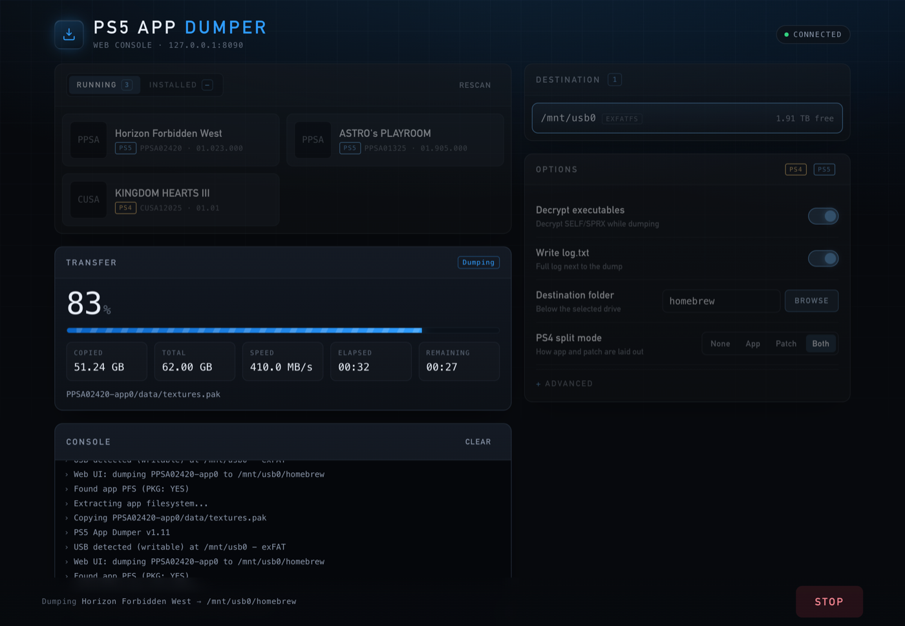

# PS5 App Dumper

**PS5 App Dumper**

A small utility to dump PS5 application files from the console's `pfsmnt` to a connected USB storage device. This project builds into an ELF payload that runs on the PS5 and copies the app files to a mounted USB drive — **it does not support network transfers**.

Since v1.11 the payload also serves a **web interface**. Start it once, then drive the dump from your phone or PC: pick the running title, pick the drive, change the settings and watch the progress live. The game keeps running the whole time.

---

## Important note

This tool **only dumps to USB**. The web interface controls the dump over the network, but the files themselves are always written to a drive attached to the console. It does **not** stream or transfer dumps over the network.

---

## Web interface



1. Plug in the USB drive and start the payload (see *Usage* below). A notification shows the address, for example `http://192.168.1.42:8081`.
2. Open that address in any browser on the same network — a phone or PC works well, or the console's own browser.
3. Press **Start** on a title, or launch the game on the console yourself. The game that is up appears as a card at the top of the list.
4. Once it shows up under **Running**, choose the destination drive and press **Start dump**.

The page shows every mounted title with its name, icon and version, the size of the selected title against the free space on each drive, the live transfer rate with an ETA, and the full log output. Settings changed in the page are written straight to `config.ini`.

**Starting titles:** the list shows what is installed on the console, internal and external drives alike, with the running game on top. Press **Start** and the payload launches the title, waits for it to mount and selects it for you. A PS5 runs one game at a time, so starting a title closes the running one — the button asks first.

Not every title starts this way. A title that the console itself refuses to launch from the home screen will not start from here either, and the page says so. If the console does not expose the launch service at all, the tab still lists the titles but without Start buttons.

**Disc or package:** every title carries a **DISC** or **PKG** badge, and **DISC OUT** marks a disc game whose disc is not in the drive. With the disc out the payload goes by what it has seen before (kept in `disc_titles.txt` next to `config.ini`) and by the disc-copy bitmap an install from disc leaves behind — a guess, which the queue lets you correct.

**Queue:** press **+ Queue** on several installed titles to dump them in one go. The queue card on the right orders them, and **Start queue** hands the list to the console: each title is started — which closes the one before it — and once it shows up as the running title it gets the *load time* to finish loading (`queue_delay`, 30 seconds by default) before it is dumped. A title that does not come up, does not fit on the drive or fails to dump is marked and the queue moves on. **Stop queue** aborts the current dump and skips the rest; the button next to it leaves only the title at hand and lets the queue carry on with the next one - **Skip this title** while it waits for a disc, the launch or the load time, **Stop this dump** once it is dumping, which asks first because the files written so far stay behind incomplete.

Several disc games can share a queue. When the next title is a disc game and its disc is not in the drive, the queue holds — for as long as it takes, with a reminder on the console every two minutes — and carries on a few seconds after the disc is in. Every queued title has a settings button: decrypt, FSELF, backport target and the PS4 split mode can differ from title to title, and a title with settings of its own is marked **CUSTOM**. Each dump writes the settings it ran with into the log.

Click the DISC/PKG badge of a queued title to correct it before starting. The queue runs on the console, so the browser can be closed in the meantime.

Before a dump starts, single or queued, its size is compared with the free space on the drive; a dump that would not fit is refused instead of filling the drive.

**When the payload is not running:** the PS5 browser keeps a copy of the page (HTML5 application cache), so the home-screen shortcut opens it even then. The page says that the dumper is not running and reconnects by itself once it is. If Payload Manager (pldmgr) is running on the console and has a ps5-app-dumper ELF in its payload list (any file name starting with `ps5-app-dumper`), the page offers a button that asks it to start the dumper. Nothing depends on this: without pldmgr the button simply is not there. After updating the payload the cached page refreshes itself on the next visit.

**Keeping it in Payload Manager:** a payload sent over the network is gone after a reboot. Under *Menu > Settings* the page can store the running version in pldmgr as `ps5-app-dumper_v<version>.elf`; pldmgr reads the version it shows from that file name. The build embeds a copy of the ELF for this, which is why it is built in two stages.

**Port:** the first port tried is `8081`, because the homebrew launcher normally holds `8080`. If it is busy the payload walks up to nine ports further and announces the one it settled on. Set `web_port` in `config.ini` to pick another.

**Home-screen shortcut:** open **Menu > Settings** and press **Install** next to *Home-screen shortcut* to put an "App Dumper" tile on the console's home screen. The tile opens the web interface in the console's browser. It is a shortcut only: it does **not** start the payload, so load the payload first as usual. The tile remembers the port the web interface was using when it was installed; if that changes, press **Reinstall**. Installing is refused while a dump or a queue is running. To remove the tile, delete it from the home screen like any other title.

**Turning it off:** set `enable_webui = 0` to go back to the old behaviour (dump the running title immediately and exit). With `auto_start = 1` the payload dumps the running title right at launch *and* serves the web interface, so the dump can be watched or stopped and the switch can be turned off again.

**Access code:** anyone on your network can open the page and look, but a phone or PC has to enter a six-digit code once before it may start, stop or delete anything. The console shows the code in the notification it sends at start; the dialog that asks for it can put it on the TV again, and a device that is already in finds it under *Menu > Settings*. The console's own browser never needs it. The code is kept in `config.ini` (`access_code`, next to the `access_token` devices hold afterwards) — delete both lines to lock every device out and get a new code, or switch *Ask other devices for a code* off under *Menu > Settings* to do without (`require_code = 0`). That switch only works in the console's own browser, so a phone that got in cannot leave the door open.

> The code keeps other people's devices from *changing* things. It does not hide anything: the title list, the log and folder names on your drives are readable by anyone who can reach the console, and the connection is plain HTTP. Use it on a network you trust, and shut the payload down from the footer link when you are done.

---

## Requirements

* PS5 Payload SDK by John Tornblom (required). Download and install the SDK and make it available at build time (example: `/opt/ps5-payload-sdk`).

  * Repository: [https://github.com/ps5-payload-dev/pacbrew-repo](https://github.com/ps5-payload-dev/pacbrew-repo)

* A PS5 able to run payloads (Jailbroken 1.00 - 13.60).

* A USB drive formatted and mounted on the PS5 (the dumper writes files to the USB).

* **elfldr.elf** — all delivery methods require `elfldr.elf` running on the PS5 to accept and execute incoming payloads. Download: [https://github.com/ps5-payload-dev/elfldr/releases/tag/v0.21](https://github.com/ps5-payload-dev/elfldr/releases/tag/v0.21)

---

## Building

1. Download and install the required PS5 Payload SDK. Note its path (we'll use `/opt/ps5-payload-sdk` as an example).

2. Point the project at the SDK by exporting the environment variable or editing the `Makefile`:

```bash
export PS5_PAYLOAD_SDK=/opt/ps5-payload-sdk
```

3. Build from the repository root:

```bash
make
```

You should get an ELF binary such as `ps5-app-dumper.elf`.

---

### Working on it without a console

`harness/` builds the web server, the dump job, the queue and the dump store for the host and runs them against a pretend console: `make -C harness run`, then open `http://127.0.0.1:8099/`. It needs no SDK. See `harness/README.md` for what it can and cannot show.

## Usage

Every method needs the USB drive **plugged into the console**. With the web interface the game can be started after the payload; in headless mode (`enable_webui = 0`) the game has to be **running already** when the payload launches.

### Method 1 — Homebrew launcher + webserv

1. **Copy `ps5-app-dumper` folder** to:

   * `/data/homebrew/`
   * `/mnt/usb#/homebrew/` *(replace `#` with your USB number, e.g., `usb0`, `usb1`, etc.)*
   * `/mnt/ext#/homebrew/` *(replace `#` with your EXT number, e.g., `ext0`, `ext1`, etc.)*

2. **Included Payload Files:**

   * `ps5-app-dumper.elf`
   * `homebrew.js`

3. Open the Homebrew Launcher with webserv loaded. You will see **PS5 App Dumper** listed. Select it — the payload starts in the background and shows the address of its web interface as a notification.

**Downloads:**

* Homebrew launcher: [https://github.com/ps5-payload-dev/websrv/releases/tag/v0.24](https://github.com/ps5-payload-dev/websrv/releases/tag/v0.24)
* webserv: [https://github.com/ps5-payload-dev/websrv/releases/tag/v0.26.1](https://github.com/ps5-payload-dev/websrv/releases/tag/v0.26.1)

### Method 2 — Send payload with Netcat GUI (Modded Warfare)

1. On your PC, run the Netcat GUI (Modded Warfare) to prepare to send the payload.

2. Ensure the USB drive is plugged into the console.

3. Use the Netcat GUI to send the `ps5-app-dumper.elf` payload to the PS5. The payload starts its web interface and reports the address as a notification; open it in a browser to run the dump.

**Downloads:**

* Netcat Gui 1.3: [https://www.sendspace.com/file/v765gd](https://www.sendspace.com/file/v765gd)

### Method 3 — Send payload with socat

1. Put `ps5-app-dumper.elf` in the folder where you'll run `socat` from.

2. With the USB drive plugged in, run the following command on your PC with cmd (replace `<ip>` with the PS5 IP address):

```bash
socat -t 99999999 - TCP:<ip>:9021 < ps5-app-dumper.elf
```

3. The payload will be sent to the PS5 and its log output appears in the socat status window. Open the announced address in a browser to run the dump.

**Download (socat for Windows)**: [https://github.com/tech128/socat-1.7.3.0-windows](https://github.com/tech128/socat-1.7.3.0-windows)

---

## Configuration

`config.ini` lives in `homebrew/ps5-app-dumper/`, together with the list of known disc titles and `logs/` (a general `dumper.log` plus one log per dump) - on a USB drive, or on the console itself under `/data`. **A drive that carries a `config.ini` wins**: it travels with the stick and can be edited on a PC. Without such a drive the console's copy is used, so settings and the access code survive without anything plugged in; *Menu > Settings > Copy to console* puts the drive's settings there as well. The file is rewritten whenever a setting is changed in the web interface. Files that older versions kept in `<drive>/ps5-app-dumper/` or `<drive>/homebrew/` are moved over automatically.

**Where dumps go:** to the selected destination - a USB drive, or *Console storage* (`/data`) when you choose it; it is never picked automatically while a drive is there, and always keeps 10 GB free. Each kind of destination remembers a dump folder of its own (`dump_subdir`, `dump_subdir_console`, both chosen with *Browse*); a new install defaults to `homebrew/ps5-app-dumper/dumps` on both, an existing `config.ini` keeps what it says. Browsing the console's folders needs the access code, browsing a stick does not. Dumps still go to `<drive>/homebrew/` unless `dump_subdir` says otherwise.

### The dumps you have

*Menu > Dumps* lists every dump the payload can find - on each drive and on the console, in the configured folders or anywhere else within a few levels of the root - with its size and state. **Move** takes one to another folder: within a drive at once, between a drive and the console by copying it, comparing the size, and only then removing the original; a stop or an incomplete copy removes the copy instead and leaves the dump where it was. Nothing else runs meanwhile. Dumps on the console are only listed for devices that have entered the access code.

> ShadowMount looks for games in `homebrew` and redirects an installed title to a dump it finds there - the title then shows **MOUNT**, runs from the dump instead of its package, and cannot be dumped again. Moving the dump elsewhere is the way out.

### Existing and unfinished dumps

Every dump leaves a small `<folder>.dump-info.json` next to its folder: the title, the settings it was made with, and whether it was finished. With that the payload never mixes two dumps in one folder:

* a dump that was **cut short** is removed before its title is dumped again, and is listed under *Unfinished dumps* in the destination panel, where it can be deleted;
* a **finished** dump is only replaced when you confirm it - the start button asks. A queue runs unattended, so it is told up front: *Existing dumps* in the queue card is **Skip** (the default) or **Replace**, the queued titles that are on the drive already carry a **DUMPED** badge, and starting a queue that replaces dumps asks for confirmation once. `auto_start` always leaves such a title alone;
* a folder **without** an info file - an older dump, or something else - counts as finished and is never deleted unasked.

| Key | Default | Meaning |
| --- | --- | --- |
| `enable_webui` | `1` | Serve the web interface instead of dumping right away |
| `auto_start` | `0` | Dump the running title right at launch; the web UI comes up as well |
| `web_port` | `8081` | First TCP port tried for the web interface |
| `dump_subdir` | `homebrew` | Folder below the drive that receives the dump |
| `queue_delay` | `30` | Seconds a queued title gets to load before its dump starts, 5-600 |
| `enable_decrypter` | `1` | Decrypt SELF/SPRX files while dumping |
| `enable_elf2fself` | `0` | Re-sign decrypted executables as FSELF |
| `enable_backport` | `0` | Patch SDK versions down — advanced, may break the dump |
| `ps4_backport_level` | `4` | PS4 SDK target, 1-6 |
| `ps5_backport_level` | `1` | PS5 SDK target, 1-10 |
| `enable_logging` | `1` | Write `log.txt` next to the dump |
| `split` | `3` | PS4 layout: 0 none, 1 app, 2 patch, 3 both |

---

## Contributing

Contributions are welcome. When opening issues or PRs, please include:

* Steps to reproduce the issue.
* Build logs and console output.
* The PS5 firmware version used during testing and any relevant SDK info.

---

## Credits / Links

* Project reference (This Project is base off pfsmnt): [https://github.com/logic-68/pfsmnt-dumper](https://github.com/logic-68/pfsmnt-dumper)
* Project repository: [https://github.com/EchoStretch/ps5-app-dumper](https://github.com/EchoStretch/ps5-app-dumper)
* PS5 Payload SDK (John Tornblom / pacbrew-repo): [https://github.com/ps5-payload-dev/pacbrew-repo](https://github.com/ps5-payload-dev/pacbrew-repo)
* PS5-SELF-Pager ( By Idlesauce): [https://github.com/idlesauce/ps5-self-pager](https://github.com/idlesauce/ps5-self-pager)
* PS4-App-Dumper ( By Alazif @ Scene-Collective): [https://github.com/Scene-Collective/ps4-app-dumper](https://github.com/Scene-Collective/ps4-app-dumper)
---
